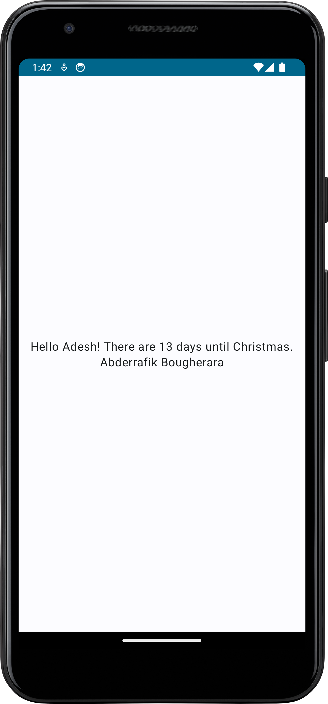
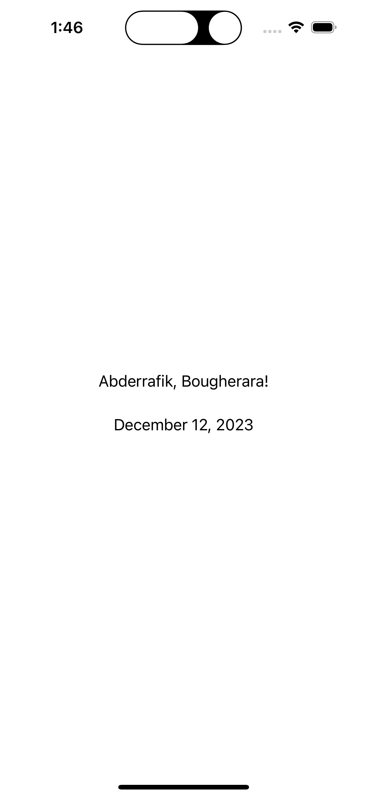

# Final Abderrafik_Bougherara_FinalProject

## Christman JS Code

```Vanilla JS code:
function getDaysUntilChristmas() {
  const today = new Date();

  let year = today.getFullYear();

  if (today.getMonth() === 11 && today.getDate() > 25) {
    year++;
  }

  const nextChristmas = new Date(year, 11, 25);
  const oneDay = 1000 * 60 * 60 * 24;
  const differenceInMilliseconds = Math.abs(nextChristmas - today);
  const differenceInDays = Math.ceil(differenceInMilliseconds / oneDay);
  console.log(differenceInDays);
  return differenceInDays;
}

getDaysUntilChristmas();
```

## iOS App Code

```Kotlin code:
import SwiftUI

struct ContentView: View {
    var body: some View {
        let date = Date()
        let formatter = DateFormatter()
        formatter.dateStyle = .long
        let dateString = formatter.string(from: date)

        return VStack {
            Text("Abderrafik, Bougherara!")
            Text(dateString)
            .padding()
        }
    }
}
```

## Android App Code

```Kotlin code:
class MainActivity : ComponentActivity() {
    override fun onCreate(savedInstanceState: Bundle?) {
        super.onCreate(savedInstanceState)
        setContent {
            MyApplicationTheme {
                // A surface container using the 'background' color from the theme
                Surface(modifier = Modifier.fillMaxSize(), color = MaterialTheme.colorScheme.background) {
                    Column(
                        modifier = Modifier.fillMaxSize(),
                        verticalArrangement = Arrangement.Center,
                        horizontalAlignment = Alignment.CenterHorizontally
                    ) {
                        Greeting("Adesh")
                        Text("Abderrafik Bougherara")
                    }
                }
            }
        }
    }
}

@Composable
fun Greeting(name: String, modifier: Modifier = Modifier) {
    val daysUntilChristmas = getDaysUntilChristmas()
    Text(
        text = "Hello $name! There are $daysUntilChristmas days until Christmas.",
        modifier = modifier
    )
}

fun getDaysUntilChristmas(): Long {
    val today = Calendar.getInstance()
    val christmas = Calendar.getInstance()
    christmas.set(Calendar.MONTH, Calendar.DECEMBER)
    christmas.set(Calendar.DAY_OF_MONTH, 25)
    if (today.timeInMillis > christmas.timeInMillis) {
        christmas.add(Calendar.YEAR, 1)
    }
    val diff = christmas.timeInMillis - today.timeInMillis
    return diff / (24 * 60 * 60 * 1000)
}
```




